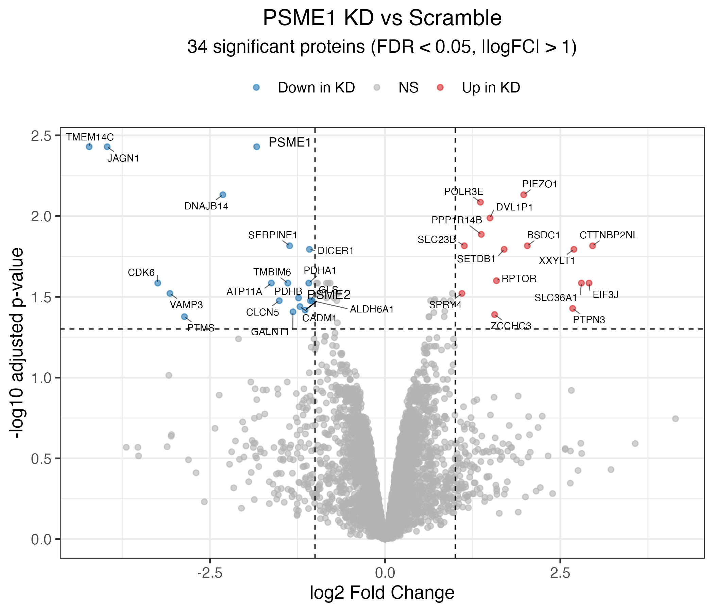
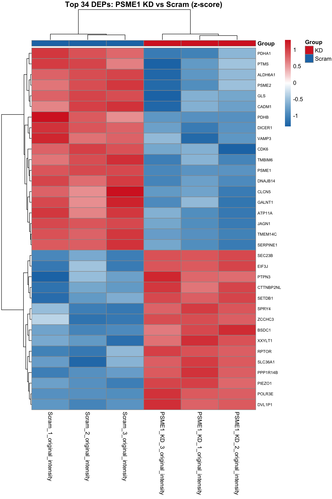

# PSME1 Knockdown vs Scram Differential Expression Analysis
Differential expression analysis of PSME1 siRNA knockdown versus scramble control 
in NCI-H441 lung adenocarcinoma cells. Triplicate samples were processed from raw, 
unnormalized intensity data through quantile normalization, limma-based linear 
modeling with empirical Bayes variance estimation, and filtered at FDR < 0.05 
with |log2FC| > 1, yielding 34 significant differentially expressed proteins.

## Project Tree

```
├── data
│   └── raw
│       ├── KD_results.csv
│       ├── psme1_vs_scram.csv
│       └── PSME1_vs_scram_raw.csv
├── README.md
├── results
│   ├── DEA_results_annotated.csv
│   ├── psme1_kd_heatmap.pdf
│   ├── psme1_kd_volcano_plot.pdf
│   ├── psme1_vs_scram_normalized.csv
│   
└── scripts
...
```

## PSME1_KD_vs_Scram_Differential_Expression



Differential expression between PSME1 KO and scramble control. Each point represents 
a protein; dashed lines mark the |log2FC| > 1 and FDR < 0.05 thresholds. 34 proteins 
meet both criteria, 18 upregulated (red) and 16 downregulated (blue) in the KO 
condition. PSME1 and its binding partner PSME2 which make up PA28ab are both downregulated as expected.

## PSME1_KD_vs_Scram_Heatmap



Z-score normalized expression of the 34 significant DEPs across all six samples, 
with hierarchical clustering on both rows and columns. KO and scramble replicates 
cluster cleanly by group, and two broad expression patterns are visible, proteins 
consistently higher in KO (bottom cluster) and those consistently lower (top cluster).

## Top Differentially Expressed Proteins

### Top 3 Upregulated

| ProteinID | UniProt | logFC | AveExpr | t | P.Value | adj.P.Val | B |
|-----------|---------|-------|---------|---|---------|-----------|---|
| CTTNBP2NL | Q9P2B4 | 2.960 | 24.462 | 11.754 | 3.26e-05 | 0.01527 | 3.141 |
| EIF3J | O75822 | 2.909 | 24.215 | 9.730 | 9.15e-05 | 0.02598 | 2.194 |
| SLC36A1 | Q7Z2H8 | 2.801 | 25.112 | 9.730 | 9.15e-05 | 0.02598 | 2.194 |

### Top 3 Downregulated

| ProteinID | UniProt | logFC | AveExpr | t | P.Value | adj.P.Val | B |
|-----------|---------|-------|---------|---|---------|-----------|---|
| TMEM14C | Q9P0S9 | -4.223 | 25.525 | -19.413 | 1.98e-06 | 0.00372 | 5.271 |
| JAGN1 | Q8N5M9 | -3.966 | 25.158 | -19.304 | 2.05e-06 | 0.00372 | 5.251 |
| VAMP3 | Q6FGG2 | -3.070 | 24.356 | -8.636 | 1.74e-04 | 0.03010 | 1.572 |